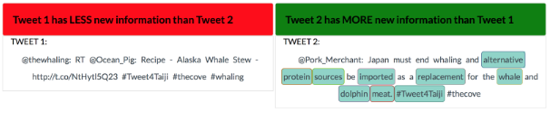
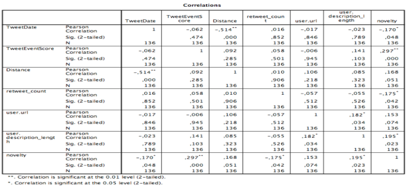
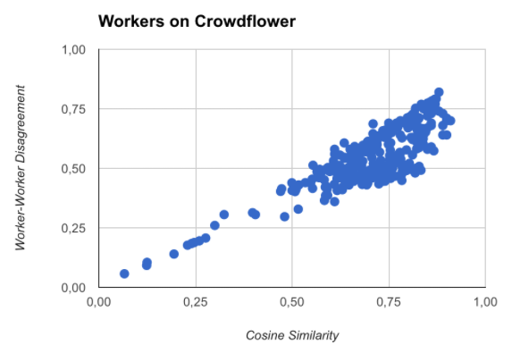

# Novelty Detection
##Crowdsourcing novelty annotation data from tweets regarding the whaling activist event

This repository contains the necessary steps and data collected and executed to reproduce the results for novelty detection in tweets. First, the collection of tweets and data are elaborated. The tweets are collected based on seed words given by activist event experts. Based on these seed words, data from the Twitter API are collected. In this section each feature is given a description. Subsequently, with the collected data, crowdsource experiments are run on the Crowdflower platform. The experiments and tasks are written in Javascript and a proprietary markup language from Crowdflower. Furthermore, the CrowdTruth platform is utilized to detect any sub-groups or spammers contaminating the annotation data.

###Dataset Files
The seed words given by the social scientists for whaling event are used to collect tweets from the Twitter API. Various variables are collected statistics like retweet count, favorite count, media-links etc. Besides these data points, some other features are also collected or calculated. For relevancy to the whaling event, data from another experiment is used. This tweet event score is collected by Inel via crowdsourcing. Workers annotated at what rate words or sentences relate with the event. Two parts of the collected and processed data are presented here, a short description of the variables are given in the following section.

####Workers
- Worker_ID: Unique ID of the worker
- More_novel: Amount of times worker selected more novel for a tweet
- Equally_novel: Amount of times worker selected equally novel for a tweet
- Less_novel: Amount of times worker selected less novel for a tweet
- Irrelevant: Amount of times worker selected irrelevant for a tweet
- Irrelevant_behavior: Percentage of times the worker selected irrelevant for a tweet
- Novelty_selection_percentage: Percentage of times the worker selected a novelty option for a tweet
- Same_answer: True if user continuously only chooses one option
- Average_novel_words: Average novel words highlighted by worker
- Average_NOT_novel_words: Average not-novel words highlighted by worker
- Novelty_cosine_similarity: Cosine similarity measure from CrowdTruth for novelty option for tweets
- Novelty_worker_disagreement: Worker disagreement measure from CrowdTruth for novelty option for tweets
- Spammer: Worker noted as a spammer by filters

####Tweets
- Tweet_ID: Unique ID of the tweet
- Tweet_content: Content text of a tweet
- Tweet_date: Date when tweet was posted
- Tweet_event_score: Rate of event relevance
- Distance_similarity: Smallest Levenshtein distance between former tweets and the selected tweet.
- ID: Tweet ID from the Twitter API
- User.handles: Twitter handles of the user
- User.followers: Amount of followers of user
- User.favorites_count: Amount of tweets the user favorited
- Retweet_count: Amount of times the tweet was retweeted
- Favorite_count: Amount of times the tweet was favorited
- Entities.urls: URL’s in tweets
- Media_type: Type of media in tweet (photo, video or other)
- User.friends_count: Amount of friends of user
- User.listed_count: In how many lists is the user listed
- User.url: URL given by the user for his profile
- User.description_length: Length of description of the user profile
- User.created_at: Date when twitter account was created
- User.profile_image_url: If a custom profile image is used
- User.profile_banner_url: If a custom profile banner is used
- Hashtag: Hashtags in tweet
- Entities_count: Amount of entities in tweet
- Sentiment_score: Sentiment score of tweet
- Novelty: novelty status of tweet

###Crowdsourcing Experiments

The tasks on the Crowdflower platform consisted of two tasks. **“Novelty selection (1)”** task: is for annotating which tweet is more novel or irrelevant. The second task **“words highlighting (2)”** asks the user to highlight words that were novel, in comparison with the event summary description.

In the **“Novelty selection”** part of the task the worker is asked to select which tweet is more novel (green banner), equally novel (blue banners for both tweets), less novel (red banner) or irrelevant (grey banner). The novelty selection is done by clicking the banners multiple times. Clicking the banner results into a different selection, the user can keep clicking until the desired option is selected. The next part of the task is the **“words highlighting”** task. For all the novelty conditions, except irrelevant, the worker has to select at least one word in each tweet that is deemed novel by the worker. Multiple words can be clicked one at a time.

###Experiment Results

Of all the annotations the workers made over all the tweets, every annotation is used to score the novelty of the tweet. If the tweet was selected as more novel it gets a +1, equally novel +0.5 and less novel -1. Aggregating all the score resulted in an ordered list of novel tweets. Tweets above the threshold is noted as novel and under the threshold as less novel. Of 21000 judgements, 137 tweets were scored. This low throughput of annotation data is caused by the comparative nature of the crowdsource task. If a tweet set contained 50 tweets, the first tweet needed 50 comparison. Exhaustively going down this comparison method, creates a lot of judgements. The upside of this comparison method, is that the ambiguity of judgements can be avoided. With the scored novelty data correlation analysis showed what features were significant for novelty correlation.

Also with the cosine similarity and worker-worker disagreement, the annotation quality of workers are available. The majority of workers scored between 0.5 and 0.8 on both accounts. In short worker-worker disagreement checks if there are sub-groups within the crowd with their own opinion. Cosine similarity expresses the degree of similarity between annotations of the worker and the the aggregated unit annotation vectors (minus the vectors of that worker).

####Workflow
The [data](Data) is stored in six different folders, each one indicating the day where the tweets were created. From the [raw data](Data/1FirstDay) collected from Crowdflower, several vectors are created. One is a csv [CT_NoveltyTweetSelection](Data/1FirstDay/f762129/Vectors/CT_NoveltyTweetSelection.csv) with the worker ID, tweet ID and the corresponding annotated tweet on novelty. Four more documents are created [CT_novelwords](Data/1FirstDay/f762129/Vectors/CT_novelwords.csv), [CT_NOTnovelwords](Data/1FirstDay/f762129/Vectors/CT_NOTnovelwords.csv), [CT_Relevance](Data/1FirstDay/f762129/Vectors/CT_Relevance.csv) and [Consistency](Data/1FirstDay/f762129/Vectors/Consistency.csv). [CT_novelwords](Data/1FirstDay/f762129/Vectors/CT_novelwords.csv) and [CT_NOTnovelwords](Data/1FirstDay/f762129/Vectors/CT_NOTnovelwords.csv) contain respectively information about the highlighted words in the novel tweet and not-novel tweet. [CT_Relevance](Data/1FirstDay/f762129/Vectors/CT_Relevance.csv) contains information if the tweet is deemed relevant and [consistency](Data/1FirstDay/f762129/Vectors/Consistency.csv) tells if the worker did not highlight words in a novel or equally novel tweet.
The next set of documents add extra information about the annotations. The [avg_words](Data/1FirstDay/f762129/avg_words.csv) file contains the average amount of highlighted novel words per worker. The folder [Crowdtruth vectors](Data/1FirstDay/f762129/CrowdTruth Vectors/) contains worker-worker disagreement and cosine similarity of each vector the useed average of them. Finally, there is an aggregated file named [aggregated_selections](Data/1FirstDay/f762129/aggregated_selections.csv) containing all the available information. After determining whether a worker is a spammer the results are stored in [Spam Identifications](Data/1FirstDay/f762129/Spam Identifications), [clean_data](Data/1FirstDay/f762129/Spam Identifications/clean_data.csv) contains the annotations without the workers and [counted_scores](Data/1FirstDay/f762129/Spam Identifications/counted_scores.csv) has the aggregated score of novelty of each tweet. Another document [explanation](Data/1FirstDay/f762129/Spam Identifications/explanation.csv) states why a worker was labeled as a spammer.
 
*Average words highlighted*
After creating three sets containing information about the highlighted words, the average amount of highlighted words is calculated for each worker. This information can help in determining whether a worker is a spammer or not down the line.

*Cosine distance and worker-worker disagreement*
The next step is to use the Crowdtruth measures to check if the annotation of the worker are qualitative good. The novelty cosine calculates the distance similarity between aggregated annotation of all workers (without the current worker) and the worker itself. The worker-worker disagreement checks the degree of disagreement of the worker with the other workers. Sometimes a set of workers can disagree with the crowd without being a spammer. Worker-worker disagreement can pinpoint to sub-groups within the workers. The Crowdtruth ‘Metrics’ module is from Lepsma & Mauritz and is included in the database.

*Spammer conditions*
The gathered and created data can aid in spam detection. Under certain conditions some workers are noted as spammers.

*Counted novelty per Tweet*
After removing all the spammers from the results, the aggregated novelty score of each tweet is calculated. When a tweet is novel +1, tweet is equal +0.5 and when the tweet is not novel -1.
